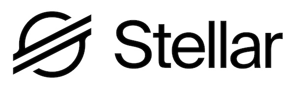

# Stellar Flutter App - Component Stellar Gateway



A Flutter Application based on gateway Stellar blockchain. You can set the origin account (Testnet) and destination account in order to process the transation in Stellar Blockchain.

This application has been built with Flutter supporting on Stellar SDK to connect with Stellar blockchain.

Platform support: Android, iOS, Mac & Web

## Getting Started

This project is a starting point for a Flutter application.

To run (Android):

```sh
flutter run apk
```

To run (iOS):

```sh
flutter run ios
```

To run (MacOS):

```sh
flutter run mac
```

To run (Web / Chrome / Brave):

```sh
flutter run chrome
```

A few resources to get you started if this is your first Flutter project:

- [Lab: Write your first Flutter app](https://flutter.dev/docs/get-started/codelab)
- [Cookbook: Useful Flutter samples](https://flutter.dev/docs/cookbook)

For help getting started with Flutter, view our
[online documentation](https://flutter.dev/docs), which offers tutorials,
samples, guidance on mobile development, and a full API reference.
